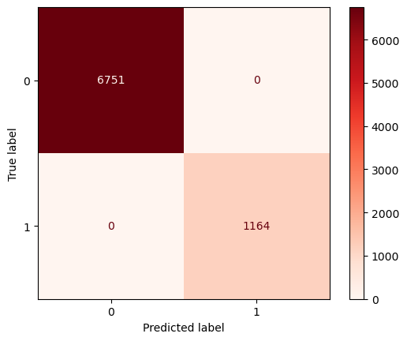

# Australia Rain Weather Forecast

Developed a machine learning project to forecast weather in Australia especially rain based on Australia weather data.

## Tools and Technologies

*   Python
*   Pandas
*   Numpy
*   Seaborn
*   Matplotlib
*   Scipy
*   Scikit-Learn
*   Feature-Engine
*   Streamlit

## Result

Confusion Matrix Prediction model improve `Random Forest`:

    - True Positive : 1183 Data (Predicted Rain and Actually Rain)
    - Ture Negative : 6732 Data (Predicted Not Rain and Actually Not Rain)
    - False Positive : 0 Data (Predicted Rain but Actually Not Rain)
    - False Negative : 0 Data (Predicted Not Rain but Actually Rain)

After improving the `Random Forest` model, although from the results of the Train-set and Tet-set there is no visible change with `F1-Score 91 %`, but in the confuion matrix there is a change, `False Negative` and `False positive` have been minimized and balanced. From there, the results of the model improvement can be seen.

## Conclusion

From the beginning I have chosen to use the `F1-Score` evaluation metric, because in the case of predicting the weather we must minimize the `False Negative` and `False Positive` because, if there is a large `False Negative` condition (Predicted not to rain but it rains), people who believe in our prediction model will feel cheated and that is very bad in business, and so on the other hand if the `False Positive` condition is greater. However, we who have this model can also make a business strategy if the model predicts with very good results, such as the results of our predictions are correct then the business plan related to rainy conditions will be a very good thing.